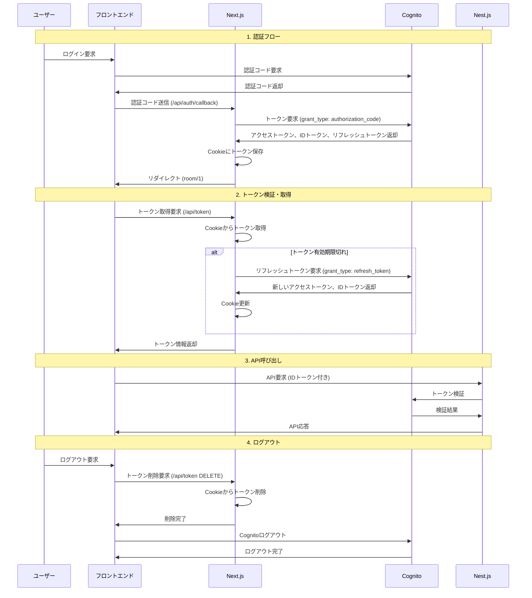
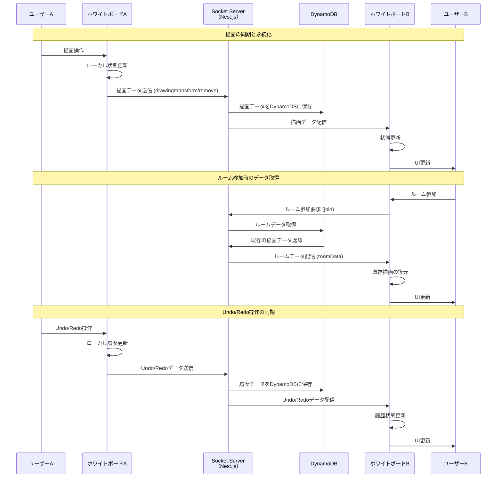

## セットアップ

1\. pnpm コマンドの実行

```bash
$ pnpm install
```

2\. .env ファイルをトップディレクトに配置

管理者に問い合わせて取得する。<br/>
.env ファイルには Cognito の認証に必要なパラメーターが記載されている。

## アプリ起動

```bash
pnpm dev
```

## ソフトウェアアーキテクチャ

プロジェクト構成はレイヤードアーキテクチャを採用。

##### プレゼンテーション層

- app /
- components /

##### アプリケーション層

- hooks /

##### ドメイン・インフラ層

- features /
  - auth /（ドメインの境界）
    - domain /（ドメイン層）
      - [...].entity.ts（状態やビジネスルールをカプセル化）
      - auth-[...].ts (値に関する業務制約を実装。ValueObject に該当。)
      - [...].repository.ts（データアクセスの抽象インターフェース。実装はインフラ層。）
    - api /（インフラ層）
  - use...Query.ts（react-query）

## エラーハンドリング

UI のレンダリング、外部連携（API）等のエラーは ErrorBoundary で一括管理。<br>
ErrorBoundary の実装は [react-error-boundary](https://www.npmjs.com/package/react-error-boundary) を使用する。

レンダリング以外の予期せぬエラー（サーバーサイドエラー、ビルド時エラー等）が発生した場合は、`global-error.tsx` で処理される。

## 認証基盤

Cognito を使用して、トークンの管理方法は JWT 認証を採用。<br>

#### JWT 認証フロー



#### セキュリティアーキテクチャの採用理由

##### XSS 対策

- HttpOnly Cookie を使用することで、悪意のあるスクリプトによるトークンの盗難を防止
- フロントエンドでトークンを直接扱わず、Next.js サーバーサイドでのみ Cookie 操作を実行

##### CSRF 対策

- Cookie の SameSite 属性により、異なるドメインからの不正なリクエストをブロック
- 各 API リクエスト時にサーバーサイドでトークンの有効性を検証

##### その他のセキュリティ対策

- アクセストークンは 30 日で期限切れ、リフレッシュトークンで自動更新
- 本番環境では HTTPS 通信を強制し、通信の暗号化を確保
- AWS Cognito による認証基盤の活用で、セキュリティベストプラクティスを継承

## ホワイトボード機能 (src/lib/konva)

ホワイトボード機能は、リアルタイム協調描画を実現するための技術サブドメインとして設計されています。

### アーキテクチャ概要

- **atoms/**: アプリ状態の単位（キャンバス、履歴、選択範囲、キーボード、ソケット、ツールなど）。UI から直接変更せず、フック経由で操作。
- **hooks/**: ビジネスロジックと副作用の境界。描画処理、座標変換、ズーム/パン、選択範囲、ステージ制御、キーボードリスナー、ソケット通信管理などを提供。
- **components/**: UI 表現層。方眼紙レイヤー、ツールバー、Provider などのビューを組み合わせ、ロジックは極力 hooks に委譲。
- **WhiteBoard.tsx**: 構成ルート。Provider/レイヤー/各種フックを組み合わせてホワイトボードを組み立てる。
- **constants.ts / types.ts**: 共有定数と型定義。描画属性、イベント、メッセージ仕様などの共通表現を集中管理。

### 主要機能

#### 描画機能

- **ペンツール**: 黒・赤ペン、マーカーによる描画
- **消しゴム**: 描画内容の削除
- **選択ツール**: 描画オブジェクトの選択・変形

#### 協調機能

- **リアルタイム同期**: Socket 通信による描画の同期
- **履歴管理**: Undo/Redo 機能
- **ルーム管理**: 複数ユーザーでの協調作業

#### 操作機能

- **ズーム**: マウスホイールによる拡大・縮小
- **パン**: Space キー + ドラッグによる移動
- **選択範囲**: 矩形選択による複数オブジェクトの選択

### 技術スタック

- **Konva.js**: Canvas 描画ライブラリ
- **Jotai**: 状態管理
- **Socket.io**: リアルタイム通信
- **DynamoDB**: 描画データの永続化
- **React Hooks**: ビジネスロジックの分離

### リアルタイム通信フロー


