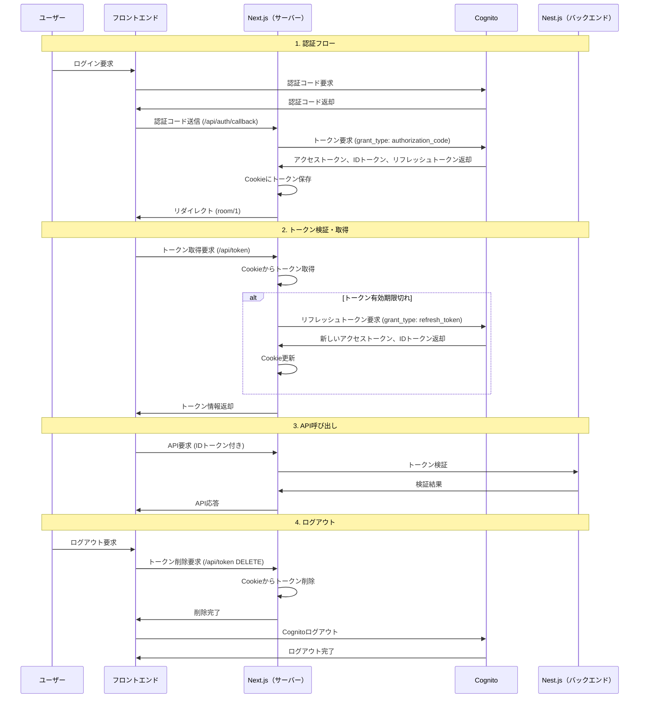

## はじめに

```bash
pnpm dev
```

## ソフトウェアアーキテクチャ

プロジェクト構成はレイヤードアーキテクチャを採用。

##### プレゼンテーション層

- app/
- components/

##### アプリケーション層

- hooks/

##### ドメイン・インフラストラクチャ層

- features/
  - auth/（ドメインの境界）
    - domain/（ドメイン層）
      - [...].entity.ts（ビジネスルールや業務制約をカプセル化）
      - [...].repository.ts（データアクセスの抽象インターフェース）
    - api/（インフラストラクチャ層）
  - use...Query.ts（react-query）

## エラーハンドリング

UI のレンダリング、外部連携（API）等のエラーは ErrorBoundary で一括管理。<br>
ErrorBoundary の実装は [react-error-boundary](https://www.npmjs.com/package/react-error-boundary) を使用する。

## 認証基盤

Cognito を使用して、トークンの管理方法は JWT 認証を採用。<br>

#### JWT 認証フロー



#### セキュリティアーキテクチャの採用理由

##### XSS 対策

- HttpOnly Cookie を使用することで、悪意のあるスクリプトによるトークンの盗難を防止
- フロントエンドでトークンを直接扱わず、Next.js サーバーサイドでのみ Cookie 操作を実行

##### CSRF 対策

- Cookie の SameSite 属性により、異なるドメインからの不正なリクエストをブロック
- 各 API リクエスト時にサーバーサイドでトークンの有効性を検証

##### その他のセキュリティ対策

- アクセストークンは 15 分で期限切れ、リフレッシュトークンで自動更新
- 本番環境では HTTPS 通信を強制し、通信の暗号化を確保
- AWS Cognito による認証基盤の活用で、セキュリティベストプラクティスを継承
