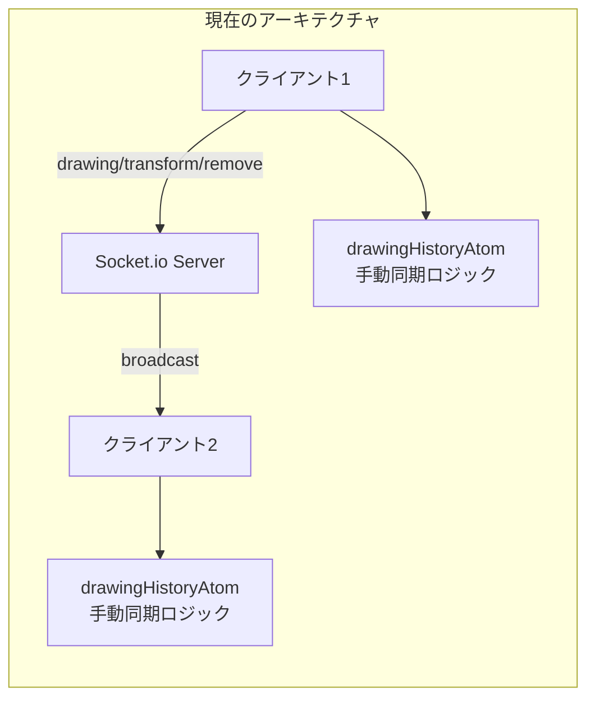
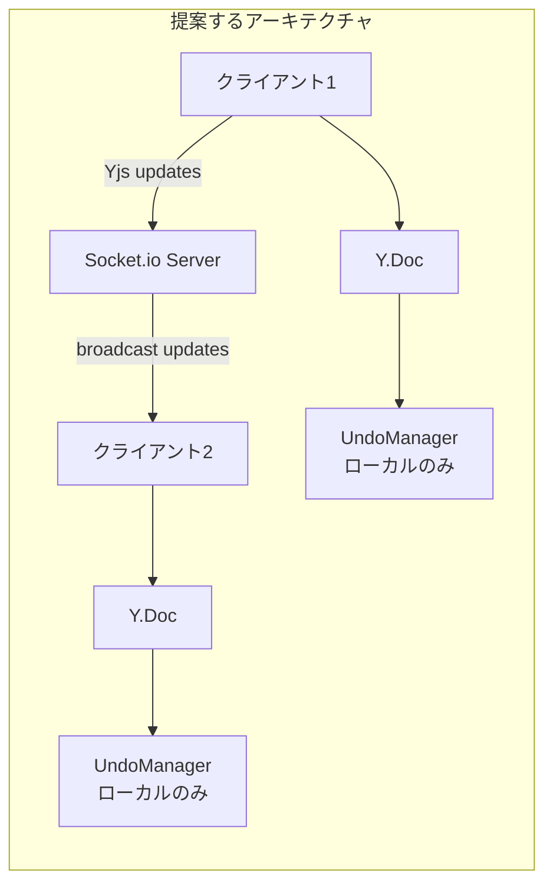
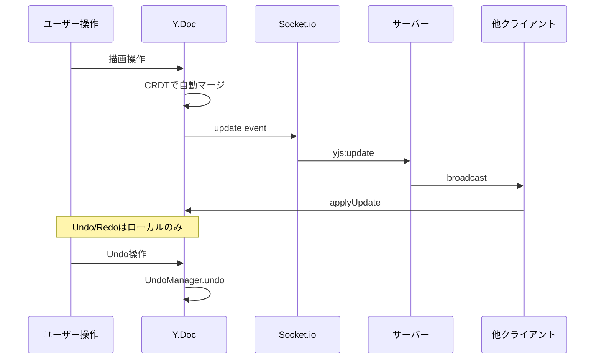

# Yjs導入による同時編集機能のリファクタリング

## 概要

現在の手動でのデータ同期ロジック（`drawingHistoryAtom.ts`, `socketAtom.ts`）をYjsのCRDT（Conflict-free Replicated Data Type）に置き換えることで、競合解消の自動化とコード量の削減を実現します。

## 現状の課題



- `socketAtom.ts`で6種類のイベント（drawing, drawingEnd, transform, remove, undo, redo）を個別に処理
- 競合解消ロジックが属人化
- Undo/Redo結果をサーバー経由でブロードキャストする複雑な実装

## 提案するアーキテクチャ



## 必要なパッケージ

```bash
pnpm add yjs y-protocols
```

**注**: `y-socket.io`は使用せず、カスタムのSocket.ioプロバイダーを実装します（既存のSocket.io設定を活かすため）。

## ファイル構成

```
src/lib/konva/
├── atoms/
│   ├── yjsAtom.ts        # 新規: Y.Doc, UndoManager管理
│   ├── socketAtom.ts     # 変更: Yjs updates送受信に簡略化
│   └── drawingHistoryAtom.ts  # 削除または大幅簡略化
├── hooks/
│   ├── useYjsSync.ts     # 新規: Y.Docとローカル状態の同期
│   └── useSocketManager.ts  # 変更: emitYjsUpdate追加
└── types.ts              # 変更なし
```

## 主要な実装内容

### 1. yjsAtom.ts（新規作成）

Y.DocとYjsのデータ構造を管理するAtomを作成します。

```typescript
// Y.Docの作成
const yDoc = new Y.Doc()
const yDrawings = yDoc.getMap<Drawing>('drawings')

// UndoManager（ローカルのみ）
const undoManager = new Y.UndoManager(yDrawings)
```

### 2. socketAtom.ts の変更

現在の6種類のイベントを以下の2種類に集約：

| 現在 | Yjs導入後 |
|------|-----------|
| drawing, drawingEnd, transform, remove | `yjs:update` |
| undo, redo | ローカル処理のみ（送信不要） |

```typescript
// 変更後のイベント
newSocket.on('yjs:update', (update: Uint8Array) => {
  Y.applyUpdate(yDoc, update)
})
```

### 3. drawingHistoryAtom.ts の変更

`Y.Map`の変更を監視してKonva.Lineに変換するだけのシンプルな実装に：

```typescript
// Y.Mapの変更を監視
yDrawings.observe((event) => {
  // Konva.Lineの配列を更新
})
```

**削除されるコード**:

- `past`, `present`, `future`の履歴管理
- `extractDeletedObjects`, `extractRestoredObjects`, `extractTransformedObjects`関数
- undo/redoの結果を手動で抽出するロジック

## データフロー



## コード量の削減見込み

| ファイル | 現在 | 変更後 | 削減 |
|---------|------|--------|------|
| drawingHistoryAtom.ts | 200行 | ~50行 | 75% |
| socketAtom.ts | 159行 | ~80行 | 50% |
| 合計 | 359行 | ~130行 | 64% |

## サーバー側の要件（別途対応）

サーバー側では以下の対応が必要です：

1. `yjs:update`イベントの受信とブロードキャスト
2. ルームごとのY.Docの保持（永続化する場合）
3. 新規クライアント参加時の状態同期

## 移行手順

1. Yjsパッケージのインストール
2. `yjsAtom.ts`の作成（Y.Doc, UndoManager管理）
3. `socketAtom.ts`のYjs対応（update送受信）
4. `drawingHistoryAtom.ts`のリファクタリング
5. 各hooks/componentsの更新
6. サーバー側の対応（別途）

## 注意点

- **後方互換性**: サーバー側の対応が完了するまで、既存の同期方式と並行稼働が必要な場合があります
- **オフライン対応**: Yjsはオフライン時の変更も自動マージ可能ですが、本実装ではSocket.io接続時のみ同期します

