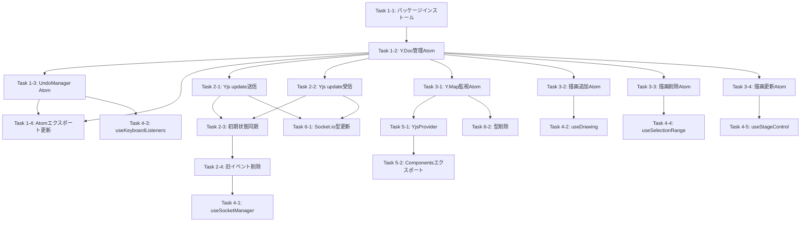

# Yjs 導入タスク一覧

## フェーズ構成

| フェーズ                            | タスク数 | 内容                                  |
| ----------------------------------- | -------- | ------------------------------------- |
| [Phase1: 基盤構築](./phase1/)       | 4        | yjs 導入、Y.Doc/UndoManager 作成      |
| [Phase2: Socket.io 連携](./phase2/) | 4        | Yjs update 送受信、旧イベント削除     |
| [Phase3: 描画状態管理](./phase3/)   | 4        | drawingHistoryAtom のリファクタリング |
| [Phase4: Hooks 更新](./phase4/)     | 5        | 各 hooks の Yjs 対応                  |
| [Phase5: Y.Map 監視](./phase5/)     | 2        | YjsProvider コンポーネント作成        |
| [Phase6: 型定義更新](./phase6/)     | 2        | Socket.io 型、不要な型の削除          |

## タスク依存関係図

## チェックリスト

- [ ] フェーズ 1: 基盤構築

  - [ ] [Task 1-1: パッケージインストール](./phase1/task-1-1-install-packages.md)
  - [ ] [Task 1-2: Y.Doc 管理 Atom の作成](./phase1/task-1-2-ydoc-atom.md)
  - [ ] [Task 1-3: UndoManager Atom の作成](./phase1/task-1-3-undo-manager.md)
  - [ ] [Task 1-4: Atom エクスポートの更新](./phase1/task-1-4-export-atoms.md)

- [ ] フェーズ 2: Socket.io 連携

  - [ ] [Task 2-1: Yjs update 送信機能の追加](./phase2/task-2-1-emit-update.md)
  - [ ] [Task 2-2: Yjs update 受信機能の追加](./phase2/task-2-2-receive-update.md)
  - [ ] [Task 2-3: 初期状態同期の実装](./phase2/task-2-3-initial-sync.md)
  - [ ] [Task 2-4: 旧イベントの削除](./phase2/task-2-4-remove-old-events.md)

- [ ] フェーズ 3: 描画状態管理のリファクタリング

  - [ ] [Task 3-1: Y.Map 監視による状態更新 Atom の作成](./phase3/task-3-1-ymap-observer.md)
  - [ ] [Task 3-2: 描画追加操作の Yjs 対応](./phase3/task-3-2-add-drawing.md)
  - [ ] [Task 3-3: 描画削除操作の Yjs 対応](./phase3/task-3-3-remove-drawing.md)
  - [ ] [Task 3-4: 描画更新操作の Yjs 対応](./phase3/task-3-4-update-drawing.md)

- [ ] フェーズ 4: Hooks 更新

  - [ ] [Task 4-1: useSocketManager のリファクタリング](./phase4/task-4-1-socket-manager.md)
  - [ ] [Task 4-2: useDrawing の Yjs 対応](./phase4/task-4-2-use-drawing.md)
  - [ ] [Task 4-3: useKeyboardListeners の Yjs 対応](./phase4/task-4-3-keyboard-listeners.md)
  - [ ] [Task 4-4: useSelectionRange の Yjs 対応](./phase4/task-4-4-selection-range.md)
  - [ ] [Task 4-5: useStageControl の Yjs 対応](./phase4/task-4-5-stage-control.md)

- [ ] フェーズ 5: Y.Map 監視の実装

  - [ ] [Task 5-1: YjsProvider コンポーネントの作成](./phase5/task-5-1-yjs-provider.md)
  - [ ] [Task 5-2: Components エクスポートの更新](./phase5/task-5-2-export-components.md)

- [ ] フェーズ 6: 型定義の更新
  - [ ] [Task 6-1: Socket.io イベント型の更新](./phase6/task-6-1-socket-types.md)
  - [ ] [Task 6-2: UndoRedoResult 型の削除](./phase6/task-6-2-remove-types.md)
