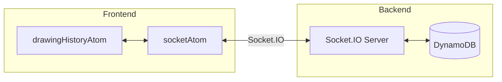
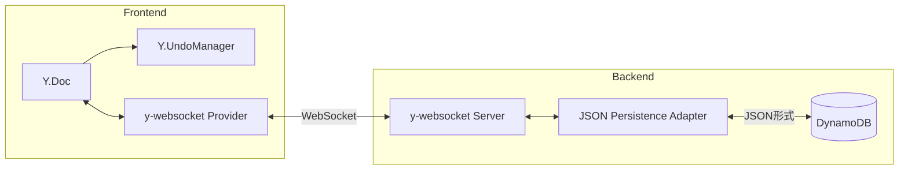

# Yjs 導入による描画同期システムのリファクタリング計画

## 現在のアーキテクチャ

- 独自の履歴管理（undo/redo）を`src/lib/konva/atoms/drawingHistoryAtom.ts`で実装
- Socket.IO で描画イベント（drawing, transform, remove, undo, redo）を送受信
- 競合解決ロジックが複雑で属人化しやすい

## 移行後のアーキテクチャ

**ポイント**: DynamoDB への保存は JSON 形式を維持し、既存のデータ構造との互換性を確保。Yjs バイナリ形式には依存しない。

---

## タスク一覧

| フェーズ | タスク               | 見積もり   | 詳細                                                     |
| -------- | -------------------- | ---------- | -------------------------------------------------------- |
| 1        | 基盤準備             | 0.5-1 日   | [phase1-setup.md](./tasks/phase1-setup.md)               |
| 2        | フロントエンド移行   | 2-3 日     | [phase2-frontend.md](./tasks/phase2-frontend.md)         |
| 3        | バックエンド変更     | 1-2 日     | [phase3-backend.md](./tasks/phase3-backend.md)           |
| 4        | テスト・旧コード削除 | 0.5-1 日   | [phase4-test-cleanup.md](./tasks/phase4-test-cleanup.md) |
| **合計** |                      | **4-7 日** |                                                          |

---

## コード量の変化

| 項目                  | 現在                                                                   | 移行後               |
| --------------------- | ---------------------------------------------------------------------- | -------------------- |
| 履歴管理（undo/redo） | 約 200 行                                                              | 約 20 行             |
| ソケット通信          | 約 160 行                                                              | 約 50 行             |
| 競合解決ロジック      | 手動実装                                                               | Yjs 自動処理         |
| イベント種別          | 7 種類（drawing, drawingEnd, transform, remove, undo, redo, roomData） | Y.Map の変更監視のみ |

---

## Yjs 導入のメリット

1. **競合解決の自動化**: CRDT により、複雑な競合解決ロジックが不要に
2. **オフラインサポート**: ローカル変更が自動的に保持され、再接続時に同期
3. **コード量削減**: undo/redo が Y.UndoManager で数行に
4. **属人性の排除**: 標準化されたライブラリで保守性向上
5. **豊富なエコシステム**: y-indexeddb（ローカル永続化）、y-webrtc（P2P）など拡張可能
6. **既存データ互換性**: JSON 形式を維持するためデータ移行不要

## リスクと対策

| リスク                     | 対策                                     |
| -------------------------- | ---------------------------------------- |
| y-websocket サーバーの運用 | 公式ドキュメントに従いヘルスチェック実装 |
| 学習コスト                 | Yjs 公式ドキュメントとサンプル活用       |
| Y.Map 監視のパフォーマンス | 大量描画時は debounce 処理を検討         |
